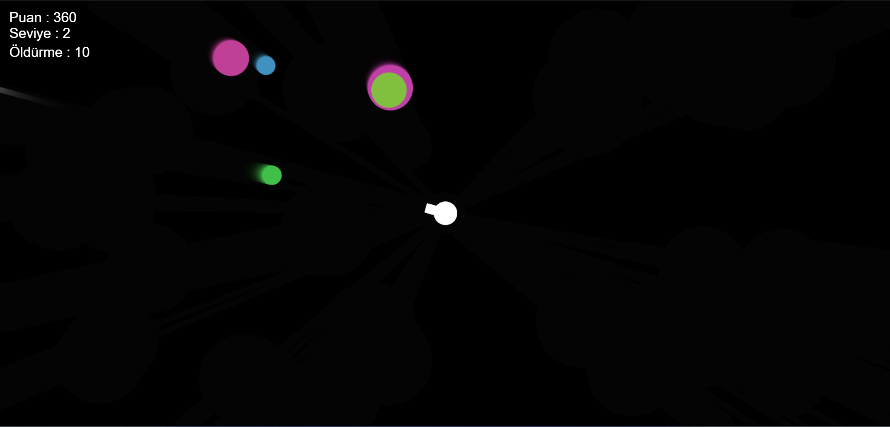
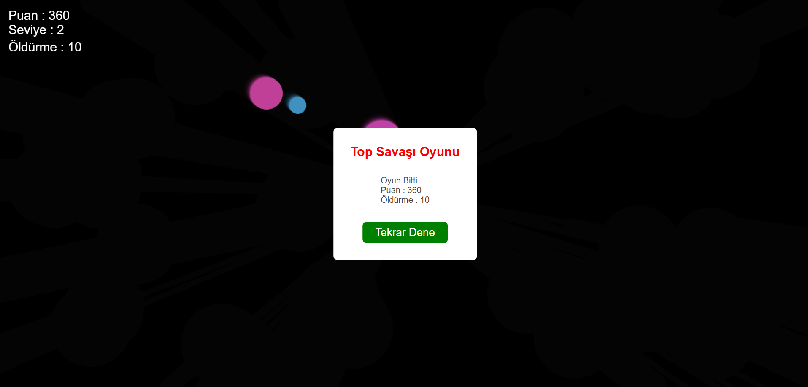

# Savaş Temalı İnteraktif Tasarım

Bu proje, savaş temalı etkileşimli bir oyun ve dijital tasarım çalışmasıdır.  
HTML, CSS ve JavaScript kullanılarak geliştirilmiştir.
## Proje Amacı

Bu projenin amacı, savaş temalı görseller ve kullanıcı etkileşimi ile dikkat çekici bir dijital oyun deneyimi sunmaktır.  
Projede hareketli nesneler, skor takibi ve oyun akışı bir araya getirilmiştir.
## Özellikler

- Savaş temalı interaktif oyun yapısı
- Skor, seviye ve öldürme sayacı
- Kullanıcı etkileşimine dayalı oyun akışı
- Tarayıcı üzerinden çalıştırılabilir kullanım
- Basit ve dikkat çekici görsel tasarım
## Kullanılan Teknolojiler

- HTML5
- CSS3
- JavaScript
## Dosya Yapısı

```bash
savas-temali-interaktif-tasarim/
│
├── README.md
├── index.html
├── main.js
├── style.css
└── assets/
    ├── oyun-ekrani.png
    └── oyun-sonu-ekrani.png
```
## Canlı Demo

Projeyi canlı olarak görüntülemek için aşağıdaki bağlantıyı kullanabilirsiniz:

[Projeyi Görüntüle](https://fmslgn.github.io/savas-temali-interaktif-tasarim/)
## Kurulum ve Çalıştırma

Projeyi kendi bilgisayarınızda çalıştırmak için aşağıdaki adımları takip edebilirsiniz:

1. Bu repoyu bilgisayarınıza indirin veya klonlayın.
2. Proje klasörünü açın.
3. `index.html` dosyasını tarayıcıda çalıştırın.
## Ekran Görüntüleri

### Oyun Ekranı


### Oyun Sonu Ekranı

## Geliştirme Notları

Bu proje eğitim amacıyla geliştirilmiştir.  
Temel oyun akışını ve kullanıcı etkileşimini içeren bu çalışma, görsel tasarım ve web tabanlı uygulama geliştirme pratiği kazanmak için hazırlanmıştır.  
İlerleyen süreçte farklı silah türleri, yeni düşman tipleri, ses efektleri ve gelişmiş animasyonlar eklenerek geliştirilebilir.
## Lisans

Bu proje eğitim amacıyla geliştirilmiş ve kişisel çalışmalar kapsamında paylaşılmıştır.
